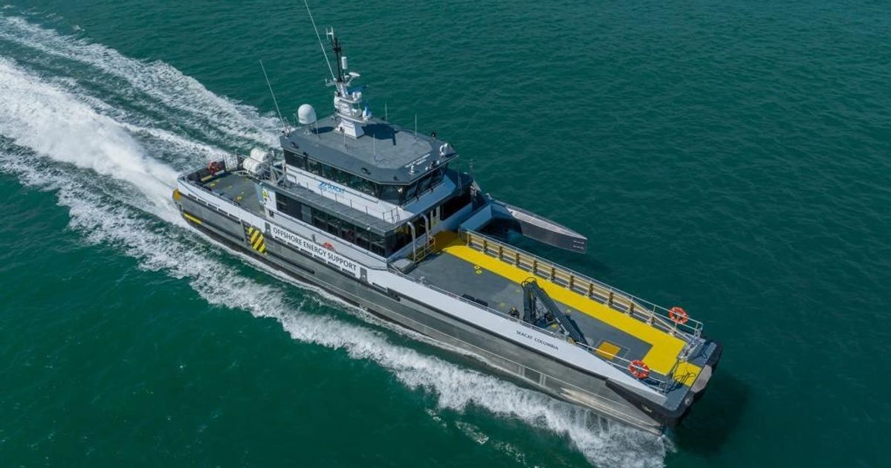
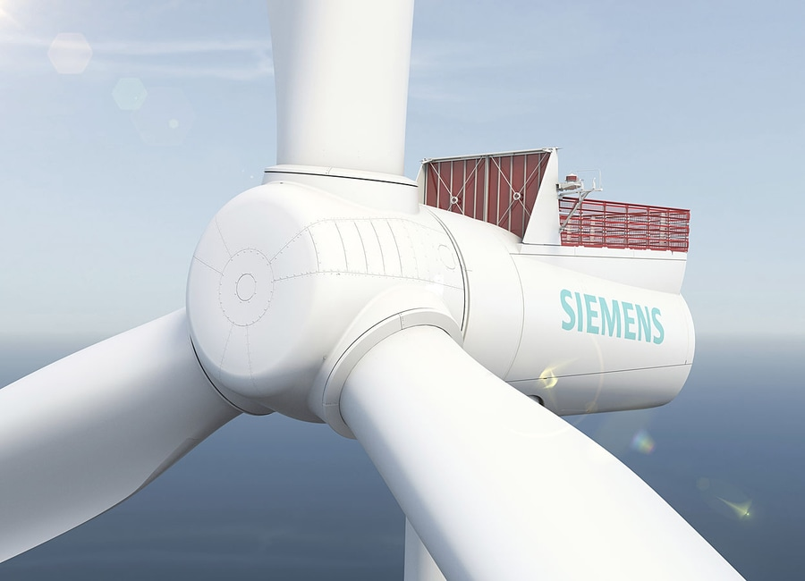
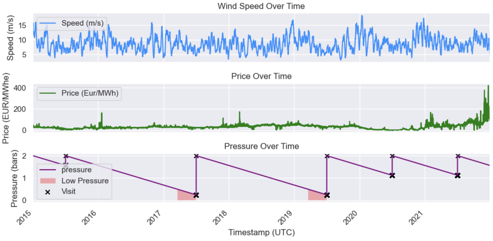

# NTNU CASE hackathon - Wind Turbine maintenance strategy

## Introduction

As the share of electricity from offshore wind is increasing [1], an increasing concern has been raised about logistic challenges they represent. 
The maintenance of offshore wind turbines involve specialized vessels and crew that are constrained by weather and logistics, leading to significant costs compared to onshore wind.

How can we optimize costs related to the maintenance of the offshore wind turbines ?

This hackathon will focus on a specific component of an offshore wind turbine, the goal is to find the optimal maintenance strategy that would maximize revenue and keep costs to a minimum. 

## Description of the problem

The total revenue is defined as follows:

    Total Revenue = ∑ (P * PP) - ∑ (VC)

    - ∑ represents the sum over all timestamps where the turbine is running
    - P represents the power produced (MWh).
    - PP stands for power price (Eur / MWh).
    - VC is the vessel cost per visit (Eur).

The total revenue is calculated as part of the MaintenanceStategy Class, the task is to edit the Sub Class that will define the desired Strategy.

For example this Sub Class illustrate a "No strategy" Scenario where the turbine is never visited

```python
class NoStrategy(MaintenanceStategy):
      
    def __init__(self) -> None:
        super().__init__()
        self.name="No Strategy"
        
    def fix_pressure(self,current_pressure,current_time,current_wind_speed,current_price):

        return False
```

This method takes as input the current state of the turbine and its environment, and should return True is the vessel is to be sent , otherwise False.

The vessel characteritics are the following:

max wind speed : the maximum wind speed for which the vessel is allowed to sail. The vessel will not sail even if the strategy says it has to.

mainenance duration : the time the vessel will spend on the turbine to fix the system, at the end the pressure is set back to its maximum value

vessel cost: the cost that will be deducted from the revenue for each round trip 

Example of a Crew Transfer Vessel typically used for troubleshooting on wind farms:


<div align="center">
    
</div>


The notebook base_notebook.ipynb can be used as a baseline to experiment the Class, it implements basic strategies and shows the corresponding objective value

## The cooling system

The system in scope is a cooling system used to cool down multiple systems in the turbine such as the bearings. It consists of a closed system that contains a coolant fluid which is cooled down on the top of the turbine and is warmed up when going inside of the turbine nacelle, as shown on the picture below.

<div align="center">
    
</div>


The coolant in the cooling system is initially pressurized and its pressure declines steadily, **the wind turbine will stop** if the pressure reaches a certain value to preserve the integrity of the turbine.

In this problem the pressure is modeled as a linear expression :

P(t)=P(t-1)-DR

- P is the pressure of the coolant
- DR : Decline rate

The two other parameters difined in the code are:

- Initial pressure : max pressure when the vessel fixes the system
- Minimum pressure : Pressure at which the turbine will stop

## Step by step methodology for revenue calculation

1 . Calculate the power associated with the wind speed at each time step    
2 . Calculate the revenue associated with the power at each time step using the price at that time.  
3 . Using the Strategy Class, calculate the downtimes due to turbine visits and shut downs    
4 . Calculate the total revenue  

assumptions:
    - Once the vessel is to be sent to the location, if the wind speed is higher than the maximum allowed wind speed, it won t sail.
    - The pressure is reset to max value after the vessel visit
    - day ahead prices used for revenue calculation

Here is an example of the coolant pressure profile over the dataset, the downtime periods are indicated in red, they correspond to the periods when the turbine is shut down because the system has reached the minimum pressure , the visits are indicated by the crosses.


<div align="center">
    
</div>

## Description of the datasets

The data is located in the data folder:

power_curve.csv : Power curve representing the power produced for a given wind speed ( dummy data )
 - Wind Speed (m/s)
 - Power (MW)

wind_data.csv : wind data for years 2015 - 2021 ( dummy data )
 - wind speed (m/s)

electricity_prices.csv : Norway whoesale price ( https://ember-climate.org/data-catalogue/european-wholesale-electricity-price-data/)
- Price (Eur/MWh)


## Brief Strategy examples

- Run To Failure

    In this strategy the operator waits for the system to fail to fix it , it means that the vessel will visit the turbine when the pressure reaches the minimum pressure.

- Scheduled maintenance

    In this strategy the operator sends a vessel at regular time intervals, independently of the system status. For example the vessel would visit the turbine on july 1st every year even whatever the pressure may be ( ideally higher than the minimum pressure )

- Condition monitoring

    This strategy relies on a measurement of the condition of the system at any time , base on sensor values. The vessel will be sent when the condition of the system is considered as critical and about to fail. In this case the vessel would be sent for example when the pressure value is 0.5 bars over the minimum value.


## Getting Started


### Google Colab ( recommended )

It should be possible to use this repo in google colab 

navigate to https://colab.research.google.com , choose "Github" and paste the repo url : https://github.com/equinor/case-hackathon-2024.git


### pip / Poetry ( more advanced users )

Before you begin, make sure you have the following requirements installed:

- git
- Python >= 3.6
- pip (or Homebrew on macOS for Poetry installation)

First, clone the repository:

```
git clone https://github.com/equinor/case-hackathon-2024.git
```

Mavigate to the cloned repository

```
cd case-hackathon-2024
```

#### Option 1: Using requirements.txt

If you want to use your current environment, you can use the requirements.txt file directly

install the required packages using pip:

```
pip install -r requirements.txt
```

#### Option 2: Using Poetry 

If you don't have Poetry installed, install it using pip or Homebrew on macOS:

```
pip install poetry
```

Or on macOS:

```
brew install poetry
```

Install dependencies with Poetry:

```
poetry install
```

activate virtual environment

```
poetry shell
```


#### Set up the jupyter kernel

Create a Jupyter notebook kernel:

```
poetry run python -m ipykernel install --user --name=case-competition-2024 --display-name="Case Competition 2024"
```

You should now be able to run the base_notebook.ipynb file using the kernel

[1]: [BloombergNEF (2023) - Offshore Wind Investment Reaches Record High](https://about.bnef.com/blog/offshore-wind-investment-hit-all-time-high-in-2023/)

